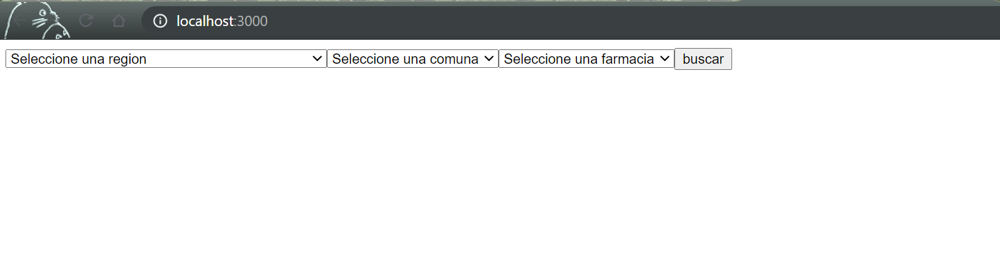
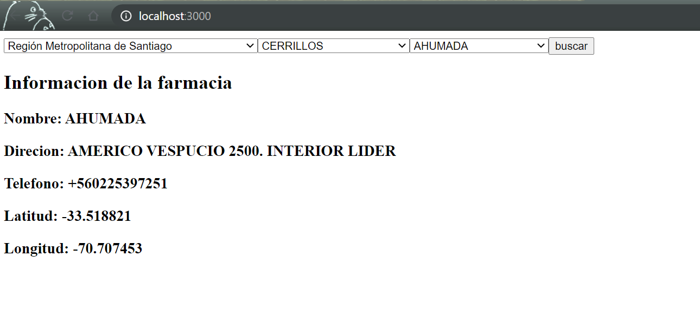

# Prueba de Consorcio

Para ejecutar la aplicacion, se requiere tener instalado python y nodejs.

los pasos son:

1. Abrir un cmd y acceder a la carpeta back e ingresar el comando 'python app.py' para levantar las apis necesarias para responder al front.
2. abrir un cmd y acceder a la carpeta front e ingresar el comando 'npm install', este instalara los modulos necesarios desde el package.json necesarios para la app.
3. luego ejecutar el comando 'npm start' y ejecutara el front donde se abrira en el browser la app front para consultar los detallles de farmacia segun filtros seleccionados.

Luego de seleccionar los filtros y darle a buscar, se visualizaran los detalles de la farmacia pedidos.

